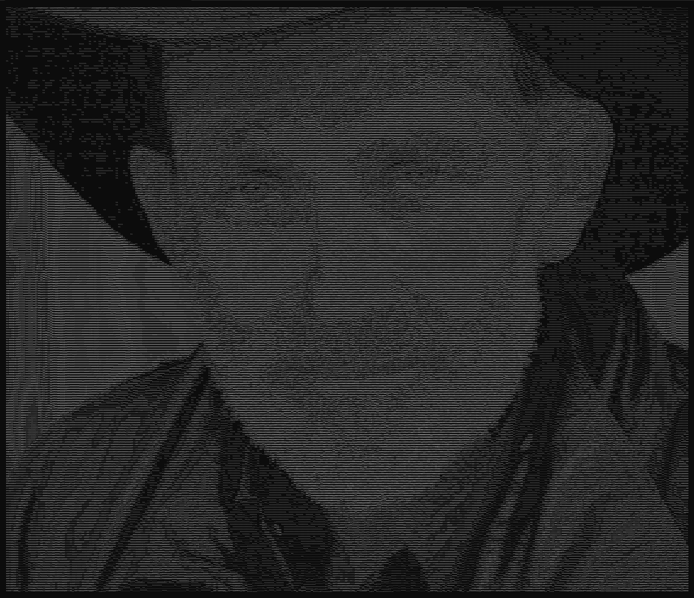
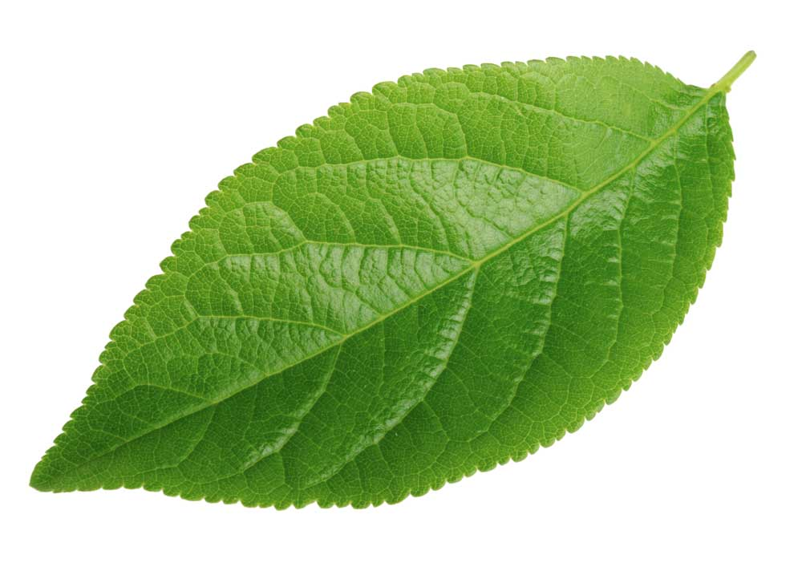
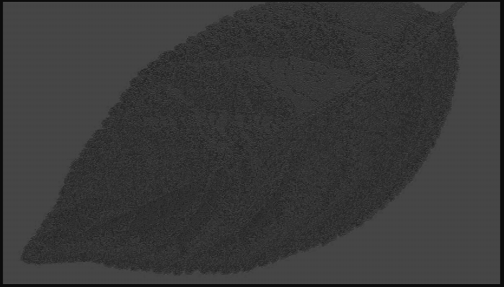
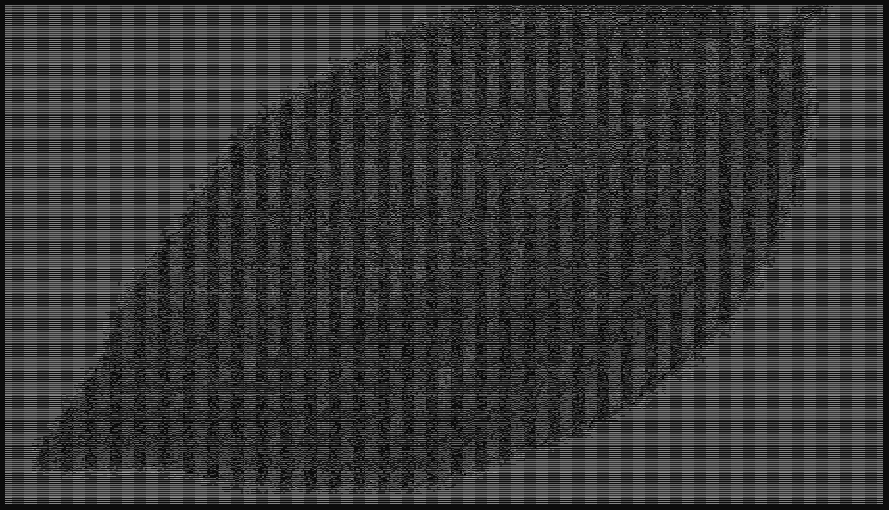
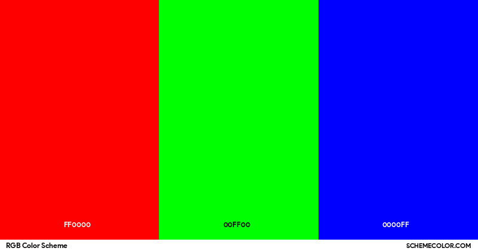
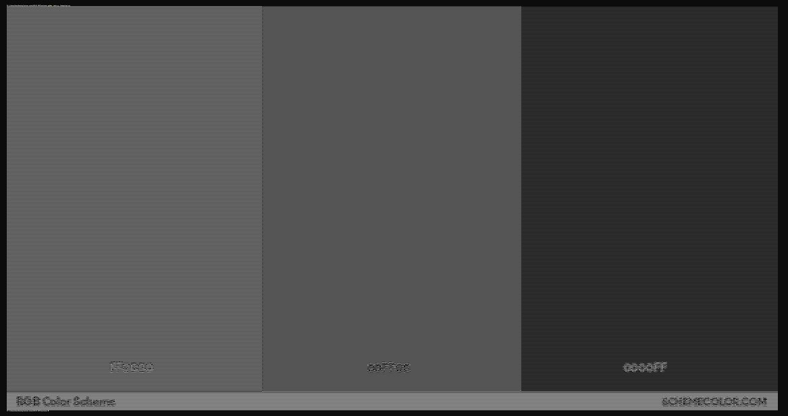
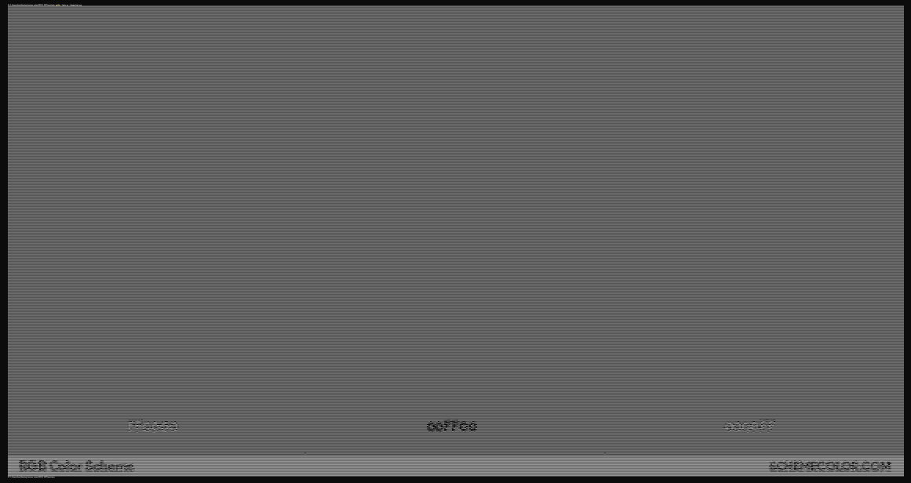
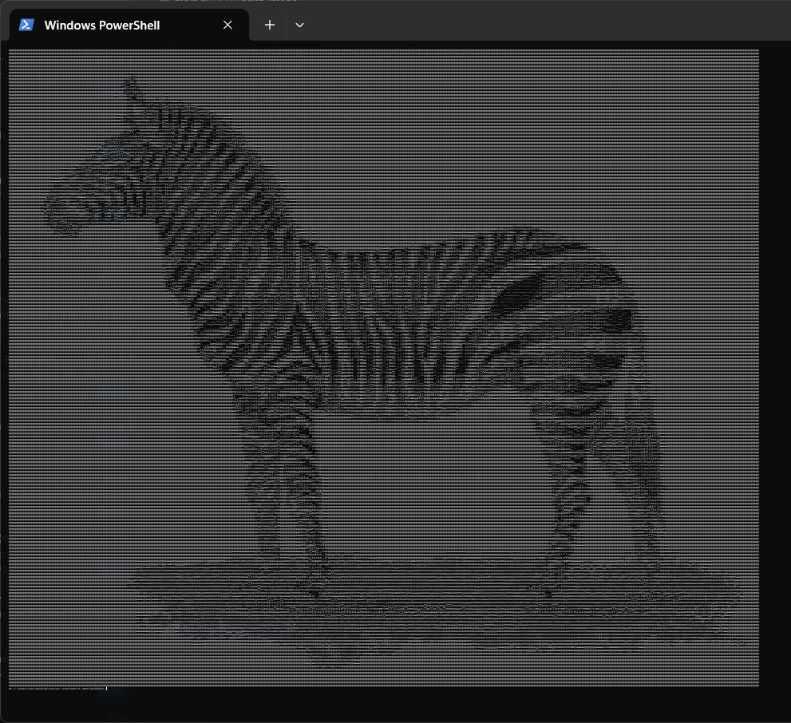
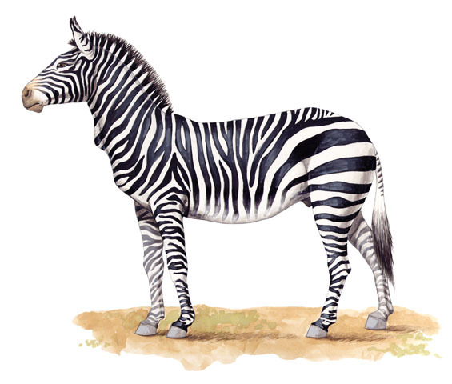

# Project 2: ASCII Art

This is a short project made during a computer vision class I am taking in GWU.
To try out this program, clone this repository and in the file directory, run:
```bash
$ python main.py <your-file-path>
```
where `<your-file-path>` is the file path of your image.

## Problem Domain and Project Description

I was curious on how to develop a system that transform visual images into ASCII art, a form of text-based imagery where the pixels of an image are replaced with characters, and compare the difference in "quality" between them. This project might strike an interest for artists, developers, and enthusiasts interested in digital art, retro computing. Example inputs include photographs, illustrations, and digital art, while outputs are ASCII conversions that maintain recognizable features and artistic integrity of the original images.

## Detailed Description of Approach

This project involves two major parts, converting the image into a greyscale version of itself, and mapping the intensity of those greyscale pixels to their corresponding ASCII characters, which vary in visual density.

The way to convert the image into greyscale is quite diverse: 

1) average: averaging the values, 

2) luminosity: taking a weighted average of the values, 

3) lightness: min-maxing the values, etc 

(lots more details [here](https://stackoverflow.com/questions/596216/formula-to-determine-perceived-brightness-of-rgb-color)). 

The two main ways I convert the image into greyscale is: 

1) using the build-in greyscale convertor from [Pillow](https://pillow.readthedocs.io/en/stable/reference/Image.html#PIL.Image.Image.convert), 

2) and using an all-averaged approach by utilising the formula: (r + g + b) / 3.

You can change different greyscale convertor by setting the `use_custom_grayscale` boolean and this section:
```python
            # Custom formula for grayscale conversion
            gray = int((r + g + b) / 3)
            grayscale_image.putpixel((x, y), gray)
```

There are different brightness scale of ASCII characters. I used the brightness scale posted [here by chungaloider](https://stackoverflow.com/questions/30097953/ascii-art-sorting-an-array-of-ascii-characters-by-brightness-levels-c-c).

You can change the brightness scale by changing the __scale.txt__ file found within the repository.

### Challenge 1: Image printed are "squished"

During this project, I noticed that the image printed is "squished", as it was slimmed down. This is due to the representation of character being rectangular as opposed to the square shape of pixels.


An easy fix is to double or triple each character every time it was printed.


### Challenge 2: Overflow of characters in a line

One aspect of this project I found surprising tough is the limitation of printing characters in the terminal, as there is limit on how much characters can be printed out on a single line before it will overflow towards the next line.


One ways to overcome this issue is making a max limit on the height and width. If the width exceeds the set limit, resize the image using Pillow's in-build [resize](https://pillow.readthedocs.io/en/stable/reference/Image.html#PIL.Image.Image.resize) function. Same goes for height. You can change the `max_width` and `max_height` found within the code.

One additional thing:
> You can change the printing output to a __txt__ file instead of printing them on the terminal by simply changing the boolean `file_print`. This way, you can share the txt file instead of screenshotting the final image.

## Results and Comparison

One aspect I tested is the difference between various greyscale convertions:

<p align="center">
    
    <br>
    Original image
    <br>
     
</p>

The first image uses the built-in Pillow function while the second image uses the all-averaged approach. There is only minute changes to the shading of the person's face, while the background is slightly altered. I think this is due to the very slight differences between the built-in Pillow function; which uses the formula: 0.299 * r + 0.587 * g + 0.114 * b; compared to the above formula. The images will look much different if the green is the more major aspect of the image:

<p align="center">
    
    <br>
    Original image
    <br>
     
</p>

The first image uses the built-in Pillow function while the second image uses the all-averaged approach. As you can see, the first image is much more detailed while the all-averaged approach's "color" is more "smoothen out".

This is more amplified by this example:

<p align="center">
    
    <br>
    Original image
    <br>
     
    <br>
    Built-in function by Pillow
    <br>
    
    <br>
    All-averaged approach
</p>

When compared to the original images, the ASCII art produced by our model retains a high level of visual integrity.

<p align="center">
     
</p>

Nevertheless, there are drawbacks, like the loss of detail in extremely complicated images, which could be fixed by improving the model's sensitivity to subtle tonal changes, adding colour in future iterations, or even improving pixel detection, for instance: putting a '/' at edges instead of using a '*'.

Even though this project successfully shows that automated ASCII art generation is feasible for many applications, more work is required to produce outputs that are professional-grade, especially in areas of better quality and faster computation.

## Tools and Resources
The project was developed in Python, utilizing libraries such as [Pillow](https://pillow.readthedocs.io/en/stable/index.html) for image processing. Data was sourced from googling different images, mainly for testing purposes.

<p align="center">
    <a href="https://animaldiversity.org/accounts/Equus_zebra/">zebra</a> <a href="https://www.ledr.com/colours/white.htm">white screen</a> <a href="https://pixabay.com/photos/people-cowboy-male-hat-person-875597/">cowboy man</a> <a href="https://www.collinsdictionary.com/us/dictionary/english/leaf#google_vignette">leaf</a> <a href="https://www.schemecolor.com/rgb.php">red green blue</a>
    
</p>
